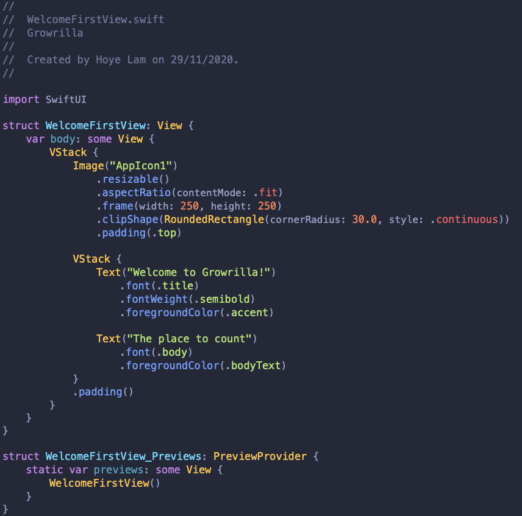

# 🎨 My Xcode theme - Palenight Hoyelam

This repository contains the Xcode theme that I use. 
The Xcode theme is inspired by [Palenigh Theme](https://marketplace.visualstudio.com/items?itemName=whizkydee.material-palenight-theme) and [Material Theme](https://marketplace.visualstudio.com/items?itemName=Equinusocio.vsc-material-theme) for Visual Studio Code. 
I made some modifications to it to my tasting. Feel free to use it or modify it to your liking 👍.



## Installing

You can also choose to do things manually if you want:

1. Clone this repo:
```
$ git clone https://github.com/hoyelam/xcode-theme.git
```

2. Create a folder at this path if it doesn't exist already:
```
~/Library/Developer/Xcode/UserData/FontAndColorThemes
```

3. Copy the file `PalenightHoyelam.xccolortheme` into the above folder.

4. Relaunch Xcode

5. Go to `Preferences` to `Themes` and then select `PalenightHoyelam`

If you have any further questions or needed help, please refer to me on Twitter:
* [Hoye Lam](https://twitter.com/hoyelam)
